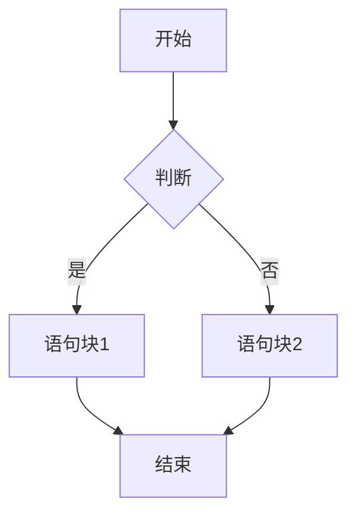
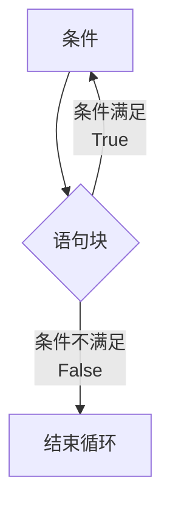
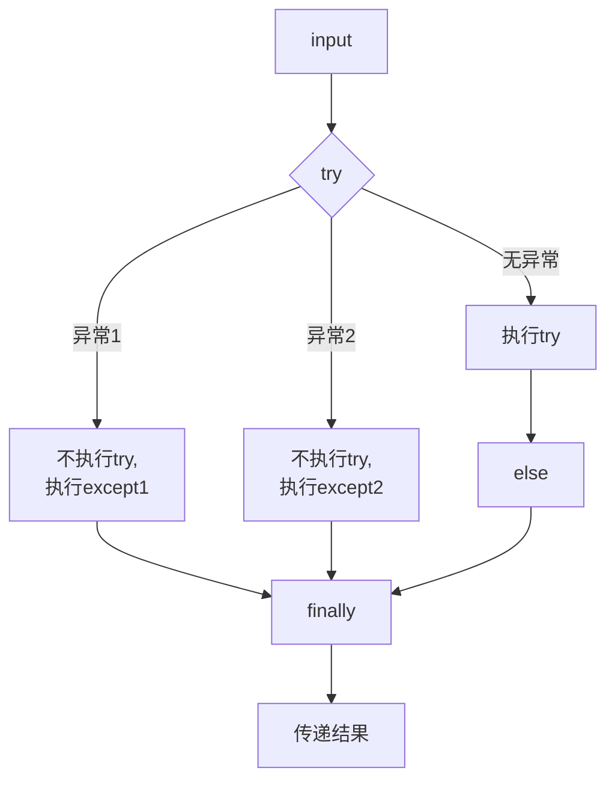

- [1. 输入,定义,输出](#输入-定义-输出)
- [2. 字符串](#字符串)
  - [2.1 索引和切片](#索引和切片)
  - [2.2 转义符](#转义符)
  - [2.3 字符串格式化](#字符串格式化)
  - [2.4 字符串操作符](#字符串操作符)
  - [2.5 字符串处理函数](#字符串处理函数)
  - [2.6 字符串处理方法](#字符串处理方法)
- [3. 组合数据类型](#组合数据类型)
  - [3.1 集合类型](#集合类型)
  - [3.2 元组类型](#元组类型)
  - [3.3 列表类型](#列表类型)
  - [3.4 字典类型](#字典类型)
  - [3.5 一维和二维数据格式化](#一维和二维数据格式化)
    - [3.5.1 一维数据](#一维数据)
    - [3.5.2 二维数据](#二维数据)
  - [3.6 迭代器和生成器](#迭代器和生成器)
  - [3.7 list.sort()和sorted()区别](#listsort和sorted区别)
- [4. 数据运算](#数据运算)
- [5. 循环和分支结构](#循环和分支结构)
  - [5.1 if loop](#if-loop)
    - [5.1.1 match-case](#match-case)
  - [5.2 for loop](#for-loop)
  - [5.3 while loop](#while-loop)
  - [5.4 try-except](#try-except)
  - [5.5 循环保留控制字](#循环保留控制字)
- [6. 函数的定义与使用](#函数的定义与使用)
  - [6.1 局部变量和全局变量](#局部变量和全局变量)
  - [6.2 lambda函数](#lambda函数)
  - [6.3 递归](#递归)
- [7. 文件的使用](#文件的使用)
- [8. 官方库](#官方库)
  - [os库](#os库)
  - [time库](#time库)
  - [turtle库](#turtle库)
  - [random库](#random库)
  - [secrets库](#secrets库)
- [9. 第三方库](#第三方库)
  - [pip的使用](#pip的使用)
  - [jieba库](#jieba库)
  - [PyInstaller库](#pyInstaller库)
  - [wordcloud库](#wordcloud库)
- [10. python程序设计方法](#python程序设计方法)

# 输入-定义-输出
`a, b = input('请输入两个值，用逗号分隔：') #一次输入多个值并用逗号分隔`  
`a, b = input("请输入两个值，用空格分隔: ").split() #一次输入多个值并用空格分隔`  
`x, y = map(int, input("请输入两个整数: ").split()) #一次输入多个值并用空格分隔且格式化为整数`  
`a, b = '','' #一次定义多个数值`  
`print('',end='') #输出完后不换行`
`print('\r',end='') #覆盖上次的输出`
# 字符串
使用' '或" "
使用''' '''创建多行字符串
## 索引和切片
正向递增序号0\~a  
反向递减序号a\~-1  
`<字符串>[M,N,K]` M开始，N结束，以步长K获取字符  
`<字符串>[M,N,-1]` 把M到N的字符串倒过来  
## 转义符
```
\b #回退
\n #换行
\r #回车
```
## 字符串格式化
槽{}  
填充，对齐，宽度 `'This is {0:+^10}'.format('PYTHON') >'This is ++PYTHON++'`  
> <左对齐 \>右对齐 ^居中对齐

数字处理 
```python
a=1234.1234 ; print(f'{a:,.3f}') > 1,234.123
#整数类型
print("{:b}".format(999)) > 1111100111
print("{:c}".format(999)) > ϧ
print("{:d}".format(999)) > 999
print("{:o}".format(999)) > 1747
print("{:x}".format(999)) > 3e7
print("{:X}".format(999)) > 3E7
#浮点数
print("{:e}".format(3.14)) > 3.140000e+00
print("{:E}".format(3.14)) > 3.140000E+00
print("{:f}".format(3.14)) > 3.140000
print("{:%}".format(3.14)) > 314.000000%
```
| : 引导符号 | <填充>      | <对齐>        | <宽度>     | <,>       | <.精度>        | <类型>       |
|------------|------------|--------------|------------|-----------|--------------|-------------|
|            | 用于填充的单个字符 | < 左对齐     | 槽设定的输出宽度 | 数字的千位分隔符 | 浮点数小数精度或字符串最大输出长度 | 整数类型：b, c, d, o, x, X |
|            |            | > 右对齐     |            |           |              | 浮点数类型：e, E, f, % |
|            |            | ^ 居中对齐   |            |           |              |             |

示例代码：
```python
>>> "{0:=^20}".format("PYTHON")
'======PYTHON======'

>>> "{0:*^20}".format("BIT")
'*******BIT*******'
```


## 字符串操作符
也可用于其它序列类型  
```python
x+y #连接xy
x*n ; n*x #复制n次x
x in s #判断x是否为s子串，返回布尔值
```

## 字符串处理函数
```python
len(x) #返回x长度

str(x) #将任意内容x变成字符串
eval(x) #将字符串x变成语句

chr(x) #unicode转字符
ord(x) #字符转unicode (0x10FFFF)

hex(x) #十进制整数转16进制字符串
oct(x) #十进制整数转8进制字符串
```
## 字符串处理方法
```python
#str用于表示字符串
str.lower() #str小写    >'AbC' > 'abc'
str.upper() #str大写

str.split(sep=None)    #按照sep分隔str 'A,BC:D'.split(':') >['A,BC','D']
str.count(sub)    #返回str出现sub的次数
str.replace(old,new)    #'ABC'.replace('A','a') > 'aBC'
str.strip(chars)    #去除两侧的chars列出的字符 'ABCDCDCBA'.strip('ABC') > 'DCD'
str.join(iter)    #在str除最后一个元素外每个元素后加一个iter，用于分隔 'abc'.join('+') > 'a+b+c'
str.center(width[,fillchar])    #在width宽度中居中，两侧用fillchar填充
```

# 组合数据类型

## 集合类型
1. 集合类型天然由不可变数据类型（整数，浮点数，复数，字符串，元组等）组成  
2. 集合中每个元素唯一，不存在相同元素**可用于数据去重**  
3. 集合之间无序  

```
#定义一个集合  
a={} #不可用于建立空集合,会默认生成字典类型
set() #可用于建立空集合
  >>> B=set("pypy123") > {'1','2','3','p','y'} #集合不能包含相同元素,且集合中的元素无序
```
|操作符及应用|描述|
|:----------:|:----------|
|S\|T|返回S和T的并集|
|S-T|返回集合S不在T中的元素集合|
|S&T|返回S和T的交集|
|S^T|返回S和T中非相同元素的集合|
|S<=T 或 S<T|返回blloean值，判断S和T的子集关系|
|S>=T 或 S>T|返回blloean值，判断S和T的包含关系|

| 增强操作符及应用 | 描述 |
|:-------------:|------|
| S \|= T  | 更新集合 S，包括在集合 S 和 T 中的所有元素 |
| S -= T  | 更新集合 S，包括在集合 S 但不在 T 中的元素 |
| S &= T  | 更新集合 S，包括同时在集合 S 和 T 中的元素 |
| S ^= T  | 更新集合 S，包括集合 S 和 T 中的非相同元素 |

集合处理方法
```python
S.add(x)    #如果x不在集合S中，将x增加到S
S.discard(x)    #移除S中元素x，如果x不在集合S中，不报错  
S.remove(x)    #移除S中元素x，如果x不在集合S中，产生KeyError异常
S.clear()    #移除S中所有元素
S.pop()    #随机返回S中的一个元素，更新S（删除去除的元素），若S为空产生KeyError异常
S.copy()    #返回集合 S 的一个副本  
len(S)    #返回集合 S 的元素个数  
x in S    #判断 S 中元素 x，x 在集合 S 中，返回 True，否则返回 False  
x not in S    #判断 S 中元素 x，x 不在集合 S 中，返回 True，否则返回 False  
set(x)    #将其他变量类型x转换为集合类型
```
## 元组类型
序列类型：  
1. 是具有先后关系的一组元素
2. 包含字符串类型，元组类型，列表类型
3. 可以使用正向递增序号0\~a，反向递减序号a\~-1 索引
  
序列通用函数和方法  
| 函数和方法 | 描述 |
|---|---|
| len(s) | 返回序列s的长度 |
| min(s) | 返回序列s的最小元素，s中元素需要可比较 |
| max(s) | 返回序列s的最大元素，s中元素需要可比较 |
| s.index(x) 或 s.index(x, i, j) | 返回序列s从i开始到j位置中第一次出现元素x的位置 |
| s.count(x) | 返回序列s中出现x的总次数 |
|sorted(ls)|返回序列从小到大排序后的新列表|

元组类型：
1. 一旦创建就不能更改
2. 可以使用或不使用小括号
```
def func():
  return 1,2 # 1,2 为元组格式
```
```
#定义一个元组类型
a=()
tuple()
```
## 列表类型
创建后可修改  
```
#定义一个列表
a=[]
list()

a=list(1,2,3)
b=a #此时a和b在内存中指向同一个列表而不是两个
```
列表函数或方法
| 函数 | 描述 |
|---|---|
| ls[i] = x | 替换列表 ls 第 i 元素为 x |
| ls[i:j:k] = lt | 用列表 lt 替换 ls 切片后所对应元素子列表 |
| del ls[i] | 删除列表 ls 中第 i 元素 |
| del ls[i:j:k] | 删除列表 ls 中第 i 到第 j 以 k 为步长的元素 |
| ls += lt | 更新列表 ls，将列表 lt 元素增加到列表 ls 后 |
| ls *= n | 更新列表 ls，其元素重复 n 次 |


|方法 | 描述 |
|---|---|
| ls.append(x) | 在列表 ls 最后增加一个元素 x |
| ls.clear() | 删除列表 ls 中所有元素 |
| ls.copy() | 生成一个新列表，赋值 ls 中所有元素 |
| ls.insert(i, x) | 在列表 ls 的第 i 位置增加元素 x |
| ls.pop(i) | 将列表 ls 中第 i 位置元素取出并删除该元素 |
| ls.remove(x) | 将列表 ls 中出现的第一个元素 x 删除 |
| ls.reverse() | 将列表 ls 中的元素反转 |

## 字典类型
1. 字典类型是映射的体现
2. 字典是键值对的集合，键值对之间无序（键值对：键是数据索引的拓展）
```python
#创建字典
a={<键1>:<值1>,<键2>:<值2>,...,<键n>:<值n>} #可以创建空字典
dict()
#新增元素
d['a']=1 #新增<'a'>:<1>
#修改元素
d['b']=1 #修改<'b'>值为<1>
#索引
a[<键1>] >>> <值1>

```
| 函数或方法| 描述|
|---|---|
| del d[k]| 删除字典 d 中键 k 对应的数据值|
| k in d| 判断键 k 是否在字典 d 中，如果在返回 True，否则 False|
| d.keys()| 返回字典 d 中所有的键信息，返回字典value类型而非列表类型|
| d.values()| 返回字典 d 中所有的值信息，返回字典value类型而非列表类型|
| d.items()| 返回字典 d 中所有的键值对信息|
| **d.get(k, \<default>)**|键k存在，则返回相应值，不在则返回\<default>值|
| d.pop(k, \<default>) | 键k存在，则取出相应值，不在则返回\<default>值|
| d.popitem()| 随机从字典d中取出一个键值对，以元组形式返回|
| d.clear()| 删除所有的键值对|
| len(d)| 返回字典d中元素的个数|

## 一维和二维数据格式化
|一维数据|二维数据|多维数据|
|---|---|---|
|由对等关系的有序或无序数据组成<br>采用线性方式堆积|由多个一维数据构成<br>是多个一维数据组合形式|在前面的类型扩展新的维度形成|
|对应列表，数组，集合等|表格等|表格等|
高维数据  
### 一维数据
1. 如果数据间有序，使用列表类型
2. 如果数据间无序，使用集合类型

一维数据的存储和读取  
1. 用空格分割    f.write(' '.join(ls)) <=> ls=txt.split()  #ls为列表形式
2. 用逗号（特殊符号或组合符号）分隔 f.write(','.join(ls))<=> ls=txt.split(',') #或其他特殊符号，ls为列表形式
3. 用换行分割 #\n

### 二维数据
二维数据统一使用二位列表类型表达  
```
[[1,2,3],
[a,b,c]]
```
csv格式：
1. 每行一个一维数据，采用','分隔，无空行，逗号与数据之间无空格
2. 如果某个元素缺失，需保留','
3. 表头可以作为数据存储，也可以另行存储
4. 数据中包含逗号，可以用\,或者","

检索方式：  
`ls[row][column] #先行后列`
  
读入数据：  
```
fo=open(name)
ls=[]
for line in fo:
  line = line.replace('\n','')
  ls.append(line.split(","))
fo.close
```
写入csv：  
```
ls=[[],[],[],...] #已有的二位列表
f=open(fname,'w')
for item in ls:
  f.write(','.join(item)+'\n')
f.close
```
逐一遍历元素：  
```
ls=[[],[],[],...] #已有的二位列表
for row in ls:
  for column in row:
    print(column)
```
## 迭代器和生成器
### 迭代器
迭代器是一个对象，它允许你遍历一个容器（如列表、元组等）中的所有元素，而无需一次性将所有元素加载到内存中  
特点：  
1. 迭代器是惰性的，即只有在需要时才生成下一个元素
2. 迭代器可以用于处理大型数据集，因为它不需要将所有数据都加载到内存中
3. 迭代器只能向前移动，不能向后移动或重置
4. 例如，Python中的文件对象，就是一个迭代器
```
iter()    #返回迭代器对象本身。
next()    #返回容器中的下一个元素,当没有更多元素时，它会引发 StopIteration 异常

my_list = [1, 2, 3]
my_iter = iter(my_list)
print(next(my_iter))  # 输出：1
print(next(my_iter))  # 输出：2
print(next(my_iter))  # 输出：3
print(next(my_iter)) #这时会触发StopIteration
```
### 生成器
生成器是一种特殊的迭代器，它使用yield关键字来生成值,每次调用yield时返回一个值并暂停执行,再次调用生成器时，会从上次暂停的地方继续执行  
特点：  
1. 生成器是一种更简洁、更方便创建迭代器的方式
2. 生成器自动实现了迭代器协议，因此你可以像使用迭代器一样使用生成器
3. 生成器可以用于创建无限序列
4. 生成器可以节省大量内存
```
def my_generator(n):
    for i in range(n):
        yield i

gen = my_generator(3)

print(next(gen))  # 输出：0
print(next(gen))  # 输出：1
print(next(gen))  # 输出：2
print(next(gen)) #这时会触发StopIteration
```

## listsort和sorted区别
| 特性| list.sort()| sorted()|
|---|---|---|
| 修改原始列表|是，原地修改列表|否，返回一个新的排序后的列表|
| 适用对象|仅适用于列表| 适用于任何可迭代对象（列表、元组、字符串等）|
| 返回值| None| 新的排序后的列表|
| 效率| 通常更快，因为是原地操作| 相对较慢，因为需要创建新列表|
| 灵活性| 相对较低，只能修改列表本身| 较高，不影响原始数据，适用于多种场景|
| 使用场景| 需要直接修改原始列表且不关心原始顺序时| 需要保留原始列表或对其他可迭代对象排序时|
```
#降序排序
list.sort(reverse=True)
a=sorted(list, reverse=True)

#自定义排序(以长度排序)
list.sort(key=len)
a=sorted(list, key=len)

#自定义对象属性
class Person:
    def __init__(self, name, age):
        self.name = name
        self.age = age

    def __repr__(self):
        return f"Person(name='{self.name}', age={self.age})"

people = [Person("Alice", 25), Person("Bob", 20), Person("Charlie", 30)]
people.sort(key=lambda person: person.age)
print(people)  # 输出：[Person(name='Bob', age=20), Person(name='Alice', age=25), Person(name='Charlie', age=30)]

#根据元组的第二个元素排序
list.sort(key=lambda x: x[1])
```


# 数据运算
```python
abs(x) #绝对值
pow(x,y[,z]) #x^y%z
round(x[,d]) #四舍五入，取d位小数
divmod(10,3) > (3,1) #商余
max（a,b,c,...,n)  #返回最大的数
min（a,b,c,...,n)

#可以将字符串转为数字
int(x) #转换为整数，非整数报错
float(x) #转换为浮点数
complex(x) #转为复数 complex(1) > 1+0j
int("1010", 2)  # 二进制 "1010" 转为 10
int("1F", 16)    # 十六进制 "1F" 转为 31
eval()

#将数字转为字符串
str()
```

# 循环和分支结构
## if-loop
```python
if a:
elif b:
else:
```

`<表达式1> if <条件> else <表达式2> #紧凑形式`

```python
if a in []:
if a not in []: #检查元素是否在序列（如列表、字符串、字典）中
if a is/not is []: #用于比较对象是否是同一个（内存地址 是否相同）
```
### match-case
```python
match a:
  case b:
    ...
  case c:
    ...
#用于模式匹配 a与b,c的关系
```
## for-loop
遍历循环  
```python
#计数循环
for i in range(M,N,K): #从M到N-1，以K为步长
    <>
[else:] #没有break则执行此代码（不是continue）
```
```python
for c in s:  #字符串循环，遍历字符串中每一个字符
for i in list:  #列表循环，遍历列表中每个元素
for line in file #文件循环，遍历每一行
```

## while-loop

无限循环  
```python
while <条件>：
    <语句块>
[else:] #没有break则执行此代码（不是continue）
```

## try-except
```python
try:
<0>
except <异常类型1>:
<1>
except (a,b): #捕获多个异常
<2>
else:
<3>
finally:
<4>

```

内置异常类型：  
Exception	所有内置异常的基类（不包括 SystemExit、KeyboardInterrupt 等）  
BaseException	所有异常的基类（包括 SystemExit 和 KeyboardInterrupt，但一般不直接使用）  
TypeError	发生类型错误，例如对整数调用字符串方法  
ValueError	传递无效参数，例如 int("abc")  
IndexError	索引超出范围，例如 lst[10]（列表越界）  
KeyError	字典中找不到指定键，例如 dict['missing_key']  
NameError	变量未定义，例如 print(undeclared_variable)  
AttributeError	访问对象不存在的属性，例如 None.some_method()  
ImportError	导入模块失败，例如 import non_existent_module  
ModuleNotFoundError	找不到模块（ImportError 的子类）  
FileNotFoundError	试图打开一个不存在的文件  
OSError	操作系统相关错误，例如文件权限问题  
ZeroDivisionError	除数为零，例如 1 / 0  
ArithmeticError	所有数学计算错误的基类，例如 ZeroDivisionError  
AssertionError	assert 语句失败  
EOFError	input() 在没有输入时触发（如 Ctrl+D 或 Ctrl+Z）  
StopIteration	迭代器遍历结束时触发  
GeneratorExit	关闭生成器时触发  
KeyboardInterrupt	用户手动中断（如 Ctrl+C）  
MemoryError	内存不足时触发  
RecursionError	递归调用超过最大深度  
  
使用Exception自定义异常：
```python
class MyCustomError(Exception):
    pass #异常语句块

try:
    raise MyCustomError("自定义错误")
except MyCustomError as e:
    print(f"捕获到异常: {e}")
```

异常发生后允许用户使用`ctrl+c`终止程序
```python
try:
    pass
except KeyboardInterrupt:
    print("程序被用户中断")
    raise  # 重新抛出 KeyboardInterrupt
```
## 循环保留控制字
break 跳出并结束**当前整个**循环  
continue 跳出**当次**循环并继续下次循环  
pass 占位符，不执行任何操作

# 函数的定义与使用  
```python
#函数的定义
def <函数名>():
  <函数体>
  return <返回值>

#没有参数和返回值的函数
def print():
  print('')
  [return]

#可选参数必须在必选参数之后，赋值成为可选参数
def <函数名>(<必选参数>,<可选参数=a>):
  <函数体>
  return <返回值>

#可变参数必须在必选参数后，用*<字母>表示
def <函数名>(<必选参数>,*b):
  <函数体>
  return <返回值>

def minus(a,*b): #使a减去不确定数量的参数b
    r=a
    for i in b:
        r-=i
    return r
print(minus(10,1,2,3)) #4

#按位置方式和按名称方式传递函数
def factor(a,b):

factor(1,2)
factor(b=2,a=1)

#多个返回值为元组类型
def：
  return a,b,c > (a,b,c)

#使返回值不为元组类型的妙妙小方法
def factor(a,b,c):
  d=a;e=b;f=c
  return d,e,f

g,h,i=factor(1,2,3)
print(g) #1
print(h) #2
print(i) #3
```
## 局部变量和全局变量
 
怪谈1：基本数据类型，无论是否重名，局部变量与全局变量不同
使用global在函数内部使用全局变量   
```
x=1
def func():
  global x
  <省略>
```
怪谈2：局部变量为组合数据类型且未创建，等同于全局变量，若组合数据类型被创建，则为局部变量  
```
ls = ['a','b']
def func(a):
    ls.append(a)
    return
func('c')
print(ls)  # ['a', 'b', 'c']
```

## lambda函数
常用于特定函数或方法的参数  
`<函数名>=lambda [<参数>]: <表达式>`
```
f=lambda x,y : x+y
f(1,2) #3
```
lambda函数固定使用方式  
占位  

## 递归
本质是函数与分支语句的组合，使用判断语句区分基例和链条  
**需要注意递归时局部变量会被释放**
```
def fact(a):
    if a == 1:
        return 1 # 递归终止条件
    else:
        return a * fact(a - 1) # 递归调用自身
print(fact(5)) # 120
```
默认递归深度为1000，可以使用`sys.setrecursionlimit()`增加递归深度  

# 文件的使用
```
#打开文本文件
<文件句柄>=open(<文本路径>,<打开方式>,<编码形式>)
  #hamlet=open(filepath, 'r', encoding='utf-8')
  #路径：C:/files/a.txt 或 C:\\files\\a.txt

with open(...) as f:  #在 with 代码块执行完毕后 自动关闭文件，不需要手动调用 f.close()
with open("example.txt", "r", encoding="utf-8") as f:
    content = f.read()  # 读取整个文件内容
print(content)  # 文件已经关闭，但仍然可以使用变量 content
```
|文件的打开模式|描述|
|---|---|
|'r'|只读模式,默认值,如果文件不存在,返回FileNotFoundError|
|'w'|覆盖写模式,文件不存在则创建,存在则完全覆盖|
|'x'|创建写模式,文件不存在则创建,存在则返回FileExistsError|
|'a'|追加写模式,文件不存在则创建,存在则在文件最后追加内容|
|'b'|二进制文件模式，可单独使用(只读)或放在上面四种类型后面 eg：wb|
|'t'|文本文件模式,默认值，可单独使用(只读)或放在上面四种类型后面 eg：wt|
|'+'|与r/w/x/a一同使用,在原功能基础上增加同时读写功能|
```
#读文件
a.read(size)
a.readline(size)
a.readlines(hint)
```
|操作方法|描述|
|---|---|
|<f>.read(size=-1)|读入全部内容,如果给出参数,读入前size长度<br>>>>s=f.read(2)<br>中国|
|<f>.readline(size=-1)|读入一行内容,如果给出参数,读入该行前size长度<br>>>>s=f.readline()<br>中国是一个伟大的国家!|
|<f>.readlines(hint=-1)|读入文件所有行,以每行为元素形成列表<br>如果给出参数,读入前hint行<br>>>>s=f.readlines()<br>['中国是一个伟大的国家!']|
```
#逐行遍历方法1,一次读入,逐行处理
fo = open("a.txt",'r')
for line in fo.readlines():
  print(line)
fo.close

#逐行遍历方法2，逐行读入,逐行处理
fo = open("a.txt",'r')
for line in fo:
  print(line)
fo.close
```

```
#写文件
a.write(s)
a.writelines(lines)
a.seek(offset)
```
|操作方法|描述|
|---|---|
|<f>.write(s)|向文件写入一个字符串或字节流<br>>>>f.write("中国是一个伟大的国家!")|
|<f>.writelines(lines)|将一个元素全为字符串的列表写入文件<br>>>>ls=["中国","法国","美国"]<br>>>>f.writelines(ls)<br>中国法国美国|
|<f>.seek(offset)|改变当前文件操作指针的位置,offset含义如下:<br>0-文件开头;1-当前位置;2-文件结尾<br>>>>f.seek(0) #回到文件开头|

```
#关闭文本文件
a.close()
```


# 官方库
# os库
1. os.path子库，处理文件路径及信息

|函数|描述|
|---|---|
|os.path.abspath(path)|返回path在当前系统中的绝对路径<br>>>>os.path.abspath("file.txt")<br>'C:\\Users\\TianSong\\Python36-32\\file.txt'|
|os.path.normpath(path)|归一化path的表示形式,统一用\\分隔路径<br>>>>os.path.normpath("D://PYE//file.txt")<br>'D:\\PYE\\file.txt'|
|os.path.relpath(path)|返回当前程序与文件之间的相对路径(relative path)<br>>>>os.path.relpath("C://PYE//file.txt")<br>'..\\..\\..\\..\\..\\..\\..\\PYE\\file.txt'|
|os.path.dirname(path)|返回path中的目录名称<br>>>>os.path.dirname("D://PYE//file.txt")<br>'D://PYE'|
|os.path.basename(path)|返回path中最后的文件名称<br>>>>os.path.basename("D://PYE//file.txt")<br>'file.txt'|
|os.path.join(path,*paths)|组合path与paths,返回一个路径字符串<br>>>>os.path.join("D:/","PYE/file.txt")<br>'D:/PYE/file.txt'|
|os.path.exists(path)|判断path对应文件或目录是否存在,返回True或False<br>>>>os.path.exists("D://PYE//file.txt")<br>False|
|os.path.isfile(path)|判断path所对应是否为已存在的文件,返回True或False<br>>>>os.path.isfile("D://PYE//file.txt")<br>True|
|os.path.isdir(path)|判断path所对应是否为已存在的目录,返回True或False<br>>>>os.path.isdir("D://PYE//file.txt")<br>False|
|os.path.getatime(path)|返回path对应文件或目录上一次的访问时间<br>>>>os.path.getatime("D:/PYE/file.txt")<br>1518356633.7551725|
|os.path.getmtime(path)|返回path对应文件或目录最近一次的修改时间<br>>>>os.path.getmtime("D:/PYE/file.txt")<br>1518356633.7551725|
|os.path.getctime(path)|返回path对应文件或目录的创建时间<br>>>>time.ctime(os.path.getctime("D:/PYE/file.txt"))<br>'Sun Feb 11 21:43:53 2018'|
|os.path.getsize(path)|返回path对应文件的大小,以字节为单位<br>>>>os.path.getsize("D:/PYE/file.txt")<br>180768|

2. os.system，处理进程管理，可以执行command命令  
`os.system(<命令行指令>)`  

3. 环境参数

|函数|描述|
|---|---|
|os.chdir(path)|修改当前程序操作的路径<br>>>>os.chdir("D:")|
|os.getcwd()|返回程序的当前路径<br>>>>os.getcwd()<br>'D:\\'|
|os.getlogin()|获得当前系统登录用户名<br>>>>os.getlogin()<br>'TianSong'|
|os.cpu_count()|获得当前系统的CPU数量<br>>>>os.cpu_count()<br>8|
|os.urandom(n)|获得n个字节长度的随机字符串,通常用于加解密运算<br>>>>os.urandom(10)<br>b'7\\xbe\\xf2!\\xc1=\\x01gL\\xb3'|

## time库
```python
#获取时间
time.time() #获取当前float值的时间戳
time.ctime() #易读的当前时间 'Fri Jan 26 12:11:16 2018'
time.gmtime() #计算机可读 time.struct_time(tm_year=2025, tm_mon=3, tm_mday=6, tm_hour=12, tm_min=9, tm_sec=1, tm_wday=3, tm_yday=65, tm_isdst=0)

#格式化时间
time.strftime(tpl,ts) #tpl:格式化模板字符串 ts:计算机内部时间变量类型 time.strftime('%Y-%m-%d %H:%M:%S',time.gmtime())
time.strptime(str.tpl) #把时间变成计算机可读 a='12:11:16 2018' time.strptime(a,'%H:%M:%S %Y')
                > time.struct_time(tm_year=2018, tm_mon=1, tm_mday=1, tm_hour=12, tm_min=11, tm_sec=16, tm_wday=0, tm_yday=1, tm_isdst=-1)

#程序计时
time.sleep(a) #程序睡觉a秒
time.perf_counter() #返回CPU级别的精确时间计数值（单位秒），常连续调用计算差值
```
| 格式化字符串 | 日期/时间说明   | 值范围和实例                      |
|------------|--------------|--------------------------------|
| %Y         | 年份         | 0000~9999，例如：1900          |
| %m         | 月份         | 01~12，例如：10               |
| %B         | 月份名称     | January~December，例如：April |
| %b         | 月份名称缩写 | Jan~Dec，例如：Apr            |
| %d         | 日期         | 01~31，例如：25               |
| %A         | 星期         | Monday~Sunday，例如：Wednesday |
| %a         | 星期缩写     | Mon~Sun，例如：Wed            |
| %H         | 小时（24h制） | 00~23，例如：12               |
| %I         | 小时（12h制） | 01~12，例如：7                |
| %p         | 上/下午      | AM, PM，例如：PM              |
| %M         | 分钟         | 00~59，例如：26               |
| %S         | 秒          | 00~59，例如：26               |

## turtle库
```python
turtlre.setup(width,height,startx,starty) #设置窗体大小位置，后两项非必须
turtle.pensize(len)
turtle.pencolor(a,b,c) #可用整数或小数或名称  
turtle.colormode(mode) #mode=1.0 或 255  
turtle.penup()  
turtle.pendown()
turtle.clear() #清空画面
turtle.fd(len) #往前爬len像素
turtle.dot(r,'color') #原地画点
turtle.goto(x,y)  
turtle.circle(len,angle)  #画angle度直径len的圆  
turtle.seth(angle) #逆时针  
turtle.left(angle) #往左转  
turtle.right(angle)
turtle.speed() #速度，越大越快，0最快
turtle.hideturtle() #绘图时不显示turtle
turtle.write(format, font=("MIcrosoft YaHei UI", 12, "normal")) #写字乌龟
turtle.done()
```


## random库
```python
#基本随机数函数
random.seed() #初始化随机数种子，不调用则默认为当前系统时间
random.random() #生成[0.0,1.0)之间的double数

#扩展随机数函数
random.randint(a,b) #生成[a,b]之间的int
random.randrange(m,n[,k]) #生成[m,n)之间以k为步长的int; random.randrange(10,100，10) > 20
random.getrandbits(k) #生成k bit长的随机int 16>37885
random.uniform(a,b) #生成[a,b]之间的随机double
random.choice(seq) #从序列中随机选取一个元素
random.shuffle(seq) #将seq中元素随机排列，返回打乱后的序列
```

## secrets库
```python
# 生成一个随机整数
random_int = secrets.randbelow(10)  # 生成 0 到 9 之间的随机整数

# 生成一个随机字节串
random_bytes = secrets.token_bytes(16)  # 生成 16 字节的随机字节串

# 生成一个随机十六进制字符串
random_hex = secrets.token_hex(16)  # 生成 16 字节的随机十六进制字符串

# 生成一个随机URL安全字符串
random_urlsafe = secrets.token_urlsafe(16)
```

# 第三方库

## pip的使用
```
pip install 库名    # 安装库（最新版本）
pip install 库名==版本号    # 安装指定版本的库，例如 pip install numpy==1.21.0
pip install 库名>=版本号    # 安装大于等于某个版本的库，例如 pip install numpy>=1.21.0
pip install -r requirements.txt    # 从 requirements.txt 批量安装

pip uninstall 库名    # 卸载库
pip install --upgrade 库名    # 更新库到最新版本

pip list    # 查看所有已安装的库
pip show 库名    # 查询某个库的详细信息（版本、安装路径等），例如 pip show numpy
pip list --outdated    # 检查是否有可更新的库

pip freeze > requirements.txt    # 导出当前环境的所有依赖到 requirements.txt
pip install -r requirements.txt    # 从 requirements.txt 还原环境（批量安装依赖）

pip cache purge    # 清理 pip 缓存

pip install 库名 -i https://pypi.tuna.tsinghua.edu.cn/simple    # 使用清华 TUNA 镜像加速安装
pip config set global.index-url https://pypi.tuna.tsinghua.edu.cn/simple    # 设置全局镜像源（清华 TUNA）

pip --version    # 查看 pip 版本
pip install --upgrade pip    # 升级 pip 到最新版本
pip help    # 查看 pip 帮助信息
```
## jieba库
用于中文分词  
精确模式： 把文本精确的切分开，不存在冗余单词。  
全模式： 把文本中所有可能的词语都扫描出来，有冗余。  
搜索引擎模式： 在精确模式基础上，对长词再次切分。  
|函数|描述|
|---|---|
|jieba.lcut(s)|精确模式，返回一个列表类型的分词结果</br>>>>jieba.lcut('监听鼠标点击事件')</br>['监听','鼠标','点击','事件']|
|jieba.lcut(s,cut_all=True)|全模式，返回一个列表类型的分词结果，存在冗余</br>>>>jieba.lcut('监听鼠标点击事件',cut_all=True)</br>['监听','鼠标','标点','点击','事件']|
|jieba.lcut_for_search(s)|搜索引擎模式，返回一个列表类型的分词结果，存在冗余</br>>>>jieba.lcut_for_search('中华人民共和国')</br>['中华', '华人', '人民', '共和', '共和国', '中华人民共和国']|
|jieba.add_word(w)|向分词词典中增加新词w|

## pyInstaller库
在命令行下  
```
pyinstaller -F <文件名.py> #在dist目录下生成同名可执行文件
```
|参数|描述|
|:------:|:------:|
|-h|查看帮助|
|--clean|清理打包过程中的临时文件|
|-D,--onedir|默认值，生成dist文件夹|
|-F,--onefile|只在dist下生成独立的打包文件|
|-i <图标.ico>|指定打包程序的图标文件|

## wordcloud库
词云展示库  
  
w=world.WorldCloud() #注意大小写
|方法|描述|
|---|---|
|w.generate(txt)|向WordCloud对象w中加载文本txt,<br>>>>w.generate("Python and WordCloud")|
|w.to_file(filename)|将词云输出为图像文件,.png或.jpg格式<br>>>>w.to_file("outfile.png")|
|width|指定词云对象生成图片的宽度,默认400像素<br>>>>w=wordcloud.WordCloud(width=600)|
|height|指定词云对象生成图片的高度,默认200像素<br>>>>w=wordcloud.WordCloud(height=400)|
|min_font_size|指定词云中字体的最小字号,默认4号<br>>>>w=wordcloud.WordCloud(min_font_size=10)|
|max_font_size|指定词云中字体的最大字号,根据高度自动调节<br>>>>w=wordcloud.WordCloud(max_font_size=20)|
|font_step|指定词云中字体字号的步进间隔,默认为1<br>>>>w=wordcloud.WordCloud(font_step=2)|
|font_path|指定字体文件的路径,默认None<br>>>>w=wordcloud.WordCloud(font_path="msyh.ttc")|
|max_words|指定词云显示的最大单词数量,默认200<br>>>>w=wordcloud.WordCloud(max_words=20)|
|stop_words|指定词云的排除词列表,即不显示的单词列表<br>>>>w=wordcloud.WordCloud(stop_words={"Python"})|
|mask|指定词云形状,默认为长方形,需要引用imread()函数<br>>>>from scipy.misc import imread<br>>>>mk=imread("pic.png")<br>>>>w=wordcloud.WordCloud(mask=mk)|
|background_color|指定词云图片的背景颜色,默认为黑色<br>>>>w=wordcloud.WordCloud(background_color="white")|

# python程序设计方法
1. IPO设计
2. 自顶向下设计

~~自顶向下：适合解决复杂问题的思维方法~~  
~~1. 将一个总问题表达为多个小问题组成的形式~~
~~2. 使用同样方法进一步分解小问题~~
~~3. 用计算机简单明了的解决小问题~~
  
~~自顶向上：逐步组件复杂系统的有效测试方法~~  
~~1. 分单元测试，逐步组装
2. 按照自顶向下相反的路径操作
3. 直至系统各部分以组装的思路都经过测试和验证~~

3. 模块化设计
    模块内部紧耦合，模块间松耦合
4. 配置化设计
    程序执行和配置分离，将可选参数配置化，将开发程序变成配置文件编写，扩展功能而不修改程序
5. 接口设计

提高用户体验的方法：
1. 进度展示
2. 合规性检查及异常处理
3. 打印帮助信息
