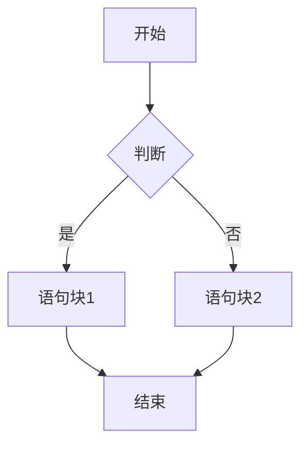
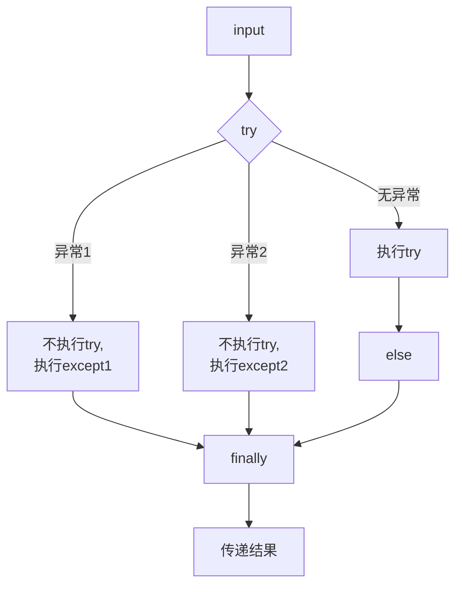

- [输入，定义](#输入，定义)
- [字符串](#字符串)
  - [索引和切片](#索引和切片)
  - [转义符](#转义符)
  - [字符串格式化](#字符串格式化)
  - [字符串操作符](#字符串操作符)
  - [字符串处理函数](#字符串处理函数)
  - [字符串处理方法](#字符串处理方法)
- [数据运算](#数据运算)
- [循环结构](#循环结构)
  - [if loop](#if-loop)
    - [match-case](#match-case)
  - [for loop](#for-loop)
  - [while loop](#while-loop)
  - [try-except](#try-except)
- [自定义函数](#自定义函数)
- [官方库](#官方库)
  - [time库](#time库)
  - [turtle库](#turtle库)
  - [secrets库](#secrets库)
     

# 输入，定义
`a, b = input('请输入两个值，用逗号分隔：') #一次输入多个值并用逗号分隔`  
`a, b = input("请输入两个值，用空格分隔: ").split() #一次输入多个值并用空格分隔`  
`x, y = map(int, input("请输入两个整数: ").split()) #一次输入多个值并用空格分隔且格式化为整数`  
`a, b = '','' #一次定义多个数值`  
# 字符串
使用' '或" "
使用''' '''创建多行字符串
## 索引和切片
正向递增序号0\~a  
反向递减序号a\~-1  
`<字符串>[M,N,K]` M开始，N结束，以步长K获取字符  
`<字符串>[M,N,-1]` 把M到N的字符串倒过来  
## 转义符
```
\b #回退
\n #换行
\r #回车
```
## 字符串格式化
槽{}  
填充，对齐，宽度 `'This is {0:+^10}'.format('PYTHON') >'This is ++PYTHON++'`  
> <左对齐 \>右对齐 ^居中对齐

数字处理 
```python
a=1234.1234 ; print(f'{a:,.3f}') > 1,234.123
#整数类型
print("{:b}".format(999)) > 1111100111
print("{:c}".format(999)) > ϧ
print("{:d}".format(999)) > 999
print("{:o}".format(999)) > 1747
print("{:x}".format(999)) > 3e7
print("{:X}".format(999)) > 3E7
#浮点数
print("{:e}".format(3.14)) > 3.140000e+00
print("{:E}".format(3.14)) > 3.140000E+00
print("{:f}".format(3.14)) > 3.140000
print("{:%}".format(3.14)) > 314.000000%
```


## 字符串操作符
```python
x+y #连接xy
x*n ; n*x #复制n次x
x in s #判断x是否为s子串，返回布尔值
```
## 字符串处理函数
```python
len(x) #返回x长度

str(x) #将任意内容x变成字符串
eval(x) #将字符串x变成语句

chr(x) #unicode转字符
ord(x) #字符转unicode (0x10FFFF)

hex(x) #十进制整数转16进制字符串
oct(x) #十进制整数转8进制字符串
```
## 字符串处理方法
```python
#str用于表示字符串
str.lower() #str小写 'AbC' > 'abc'
str.upper() #str大写

str.split(sep=None) #按照sep分隔str 'A,BC:D'.split(':') >['A,BC','D']
str.count(sub) #返回str出现sub的次数
str.replace(old,new) #'ABC'.replace('A','a') > 'aBC'
str.strip(chars) #去除两侧的chars列出的字符 'ABCDCDCBA'.strip('ABC') > 'DCD'
str.join(iter) #在str除最后一个元素外每个元素后加一个iter，用于分隔 'abc'.join('+') > 'a+b+c'
str.center(width[,fillchar]) #在width宽度中居中，两侧用fillchar填充
```
# 数据运算
```python
abs(x) #绝对值
pow(x,y[,z]) #x^y%z
round(x[,d]) #四舍五入，取d位小数
divmod(10,3) > (3,1) #商余
max（a,b,c,...,n)  #返回最大的数
min（a,b,c,...,n)

#可以将字符串转为数字
int(x) #小数取证
float(x) #转换为浮点数
complex(x) #转为复数 complex(1) > 1+0j
int("1010", 2)  # 二进制 "1010" 转为 10
int("1F", 16)    # 十六进制 "1F" 转为 31
eval()

#将数字转为字符串
str()
```

# 循环结构
## if-loop
```python
if a:
elif b:
else:
```

`<表达式1> if <条件> else <表达式2> #紧凑形式`

```python
if a in []:
if a not in []: #检查元素是否在序列（如列表、字符串、字典）中
if a is/not is []: #用于比较对象是否是同一个（内存地址 是否相同）
```
### match-case
```python
match a:
  case b:
    ...
  case c:
    ...
#用于模式匹配 a与b,c的关系
```
## for-loop
` for i in range(): `
```python
for :
  print(a,end="") #每次输出后不换行
```

## while-loop

## try-except
```python
try:
<0>
except <异常类型1>:
<1>
except (a,b): #捕获多个异常
<2>
else:
<3>
finally:
<4>

```

内置异常类型：  
Exception	所有内置异常的基类（不包括 SystemExit、KeyboardInterrupt 等）  
BaseException	所有异常的基类（包括 SystemExit 和 KeyboardInterrupt，但一般不直接使用）  
TypeError	发生类型错误，例如对整数调用字符串方法  
ValueError	传递无效参数，例如 int("abc")  
IndexError	索引超出范围，例如 lst[10]（列表越界）  
KeyError	字典中找不到指定键，例如 dict['missing_key']  
NameError	变量未定义，例如 print(undeclared_variable)  
AttributeError	访问对象不存在的属性，例如 None.some_method()  
ImportError	导入模块失败，例如 import non_existent_module  
ModuleNotFoundError	找不到模块（ImportError 的子类）  
FileNotFoundError	试图打开一个不存在的文件  
OSError	操作系统相关错误，例如文件权限问题  
ZeroDivisionError	除数为零，例如 1 / 0  
ArithmeticError	所有数学计算错误的基类，例如 ZeroDivisionError  
AssertionError	assert 语句失败  
EOFError	input() 在没有输入时触发（如 Ctrl+D 或 Ctrl+Z）  
StopIteration	迭代器遍历结束时触发  
GeneratorExit	关闭生成器时触发  
KeyboardInterrupt	用户手动中断（如 Ctrl+C）  
MemoryError	内存不足时触发  
RecursionError	递归调用超过最大深度  
  
使用Exception自定义异常：
```python
class MyCustomError(Exception):
    pass #异常语句块

try:
    raise MyCustomError("自定义错误")
except MyCustomError as e:
    print(f"捕获到异常: {e}")
```

异常发生后允许用户使用`ctrl+c`终止程序
```python
try:
    pass
except KeyboardInterrupt:
    print("程序被用户中断")
    raise  # 重新抛出 KeyboardInterrupt
```

# 自定义函数
```python
def factor(a):
  ...
return factor
```
# 官方库

## time库
```python
#获取时间
time.time() #获取当前float值的时间戳
time.ctime() #易读的当前时间 'Fri Jan 26 12:11:16 2018'
time.gmtime() #计算机可读 time.struct_time(tm_year=2025, tm_mon=3, tm_mday=6, tm_hour=12, tm_min=9, tm_sec=1, tm_wday=3, tm_yday=65, tm_isdst=0)

#格式化时间
time.strftime(tpl,ts) #tpl:格式化模板字符串 ts:计算机内部时间变量类型 time.strftime('%Y-%m-%d %H:%M:%S',time.gmtime())
time.strptime(str.tpl) #把时间变成计算机可读 a='12:11:16 2018' time.strptime(a,'%H:%M:%S %Y')
                > time.struct_time(tm_year=2018, tm_mon=1, tm_mday=1, tm_hour=12, tm_min=11, tm_sec=16, tm_wday=0, tm_yday=1, tm_isdst=-1)

#程序计时
time.sleep(a) #程序睡觉a秒
time.perf_counter() #返回CPU级别的精确时间计数值（单位秒），常连续调用计算差值
```


## turtle库
```python
turtlre.setup(width,height,startx,starty) #设置窗体大小位置，后两项非必须
turtle.pensize(len)
turtle.pencolor(a,b,c) #可用整数或小数或名称  
turtle.colormode(mode) #mode=1.0 或 255  
turtle.penup()  
turtle.pendown()
turtle.fd(len) #往前爬len像素  
turtle.goto(x,y)  
turtle.circle(len,angle)  #画angle度直径len的圆  
turtle.seth(angle) #逆时针  
turtle.left(angle) #往左转  
turtle.right(angle)  
turtle.done()
```


## secrets库
```python
# 生成一个随机整数
random_int = secrets.randbelow(10)  # 生成 0 到 9 之间的随机整数

# 生成一个随机字节串
random_bytes = secrets.token_bytes(16)  # 生成 16 字节的随机字节串

# 生成一个随机十六进制字符串
random_hex = secrets.token_hex(16)  # 生成 16 字节的随机十六进制字符串

# 生成一个随机URL安全字符串
random_urlsafe = secrets.token_urlsafe(16)
```
