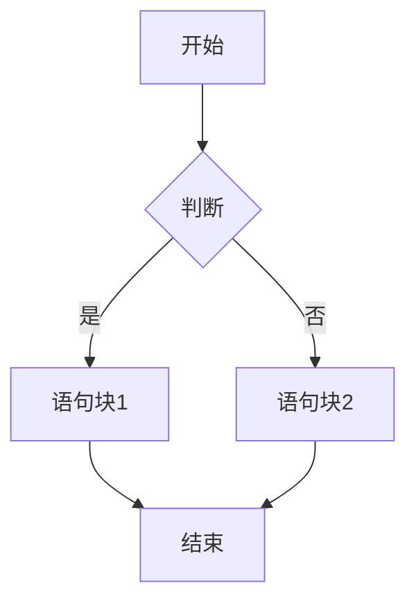
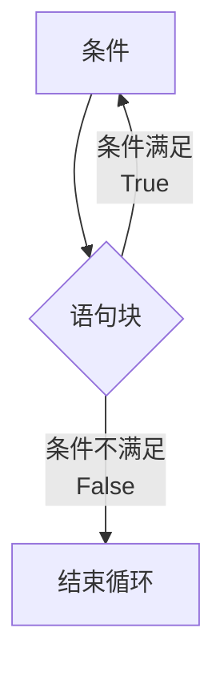
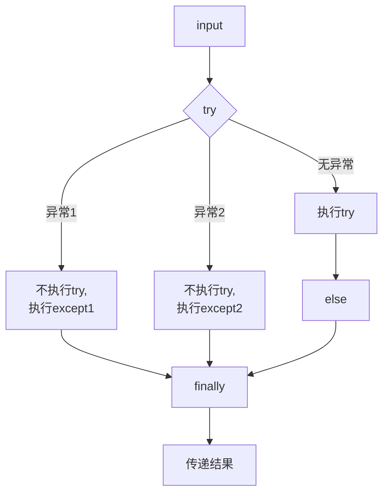

- [输入,定义,输出](#输入-定义-输出)
- [字符串](#字符串)
  - [索引和切片](#索引和切片)
  - [转义符](#转义符)
  - [字符串格式化](#字符串格式化)
  - [字符串操作符](#字符串操作符)
  - [字符串处理函数](#字符串处理函数)
  - [字符串处理方法](#字符串处理方法)
- [组合数据类型](#组合数据类型)
  - [集合类型](#集合类型)
- [数据运算](#数据运算)
- [循环和分支结构](#循环和分支结构)
  - [if loop](#if-loop)
    - [match-case](#match-case)
  - [for loop](#for-loop)
  - [while loop](#while-loop)
  - [try-except](#try-except)
  - [循环保留控制字](#循环保留控制字)
- [函数的定义与使用](#函数的定义与使用)
  - [局部变量和全局变量](#局部变量和全局变量)
  - [lambda函数](#lambda函数)
  - [递归](#递归)
- [官方库](#官方库)
  - [time库](#time库)
  - [turtle库](#turtle库)
  - [random库](#random库)
  - [secrets库](#secrets库)
- [第三方库](#第三方库)
  - [pip的使用](#pip的使用)
  - [PyInstaller库](#PyInstaller库)
     

# 输入-定义-输出
`a, b = input('请输入两个值，用逗号分隔：') #一次输入多个值并用逗号分隔`  
`a, b = input("请输入两个值，用空格分隔: ").split() #一次输入多个值并用空格分隔`  
`x, y = map(int, input("请输入两个整数: ").split()) #一次输入多个值并用空格分隔且格式化为整数`  
`a, b = '','' #一次定义多个数值`  
`print('',end='') #输出完后不换行`
`print('\r',end='') #覆盖上次的输出`
# 字符串
使用' '或" "
使用''' '''创建多行字符串
## 索引和切片
正向递增序号0\~a  
反向递减序号a\~-1  
`<字符串>[M,N,K]` M开始，N结束，以步长K获取字符  
`<字符串>[M,N,-1]` 把M到N的字符串倒过来  
## 转义符
```
\b #回退
\n #换行
\r #回车
```
## 字符串格式化
槽{}  
填充，对齐，宽度 `'This is {0:+^10}'.format('PYTHON') >'This is ++PYTHON++'`  
> <左对齐 \>右对齐 ^居中对齐

数字处理 
```python
a=1234.1234 ; print(f'{a:,.3f}') > 1,234.123
#整数类型
print("{:b}".format(999)) > 1111100111
print("{:c}".format(999)) > ϧ
print("{:d}".format(999)) > 999
print("{:o}".format(999)) > 1747
print("{:x}".format(999)) > 3e7
print("{:X}".format(999)) > 3E7
#浮点数
print("{:e}".format(3.14)) > 3.140000e+00
print("{:E}".format(3.14)) > 3.140000E+00
print("{:f}".format(3.14)) > 3.140000
print("{:%}".format(3.14)) > 314.000000%
```


## 字符串操作符
```python
x+y #连接xy
x*n ; n*x #复制n次x
x in s #判断x是否为s子串，返回布尔值
```
## 字符串处理函数
```python
len(x) #返回x长度

str(x) #将任意内容x变成字符串
eval(x) #将字符串x变成语句

chr(x) #unicode转字符
ord(x) #字符转unicode (0x10FFFF)

hex(x) #十进制整数转16进制字符串
oct(x) #十进制整数转8进制字符串
```
## 字符串处理方法
```python
#str用于表示字符串
str.lower() #str小写 'AbC' > 'abc'
str.upper() #str大写

str.split(sep=None) #按照sep分隔str 'A,BC:D'.split(':') >['A,BC','D']
str.count(sub) #返回str出现sub的次数
str.replace(old,new) #'ABC'.replace('A','a') > 'aBC'
str.strip(chars) #去除两侧的chars列出的字符 'ABCDCDCBA'.strip('ABC') > 'DCD'
str.join(iter) #在str除最后一个元素外每个元素后加一个iter，用于分隔 'abc'.join('+') > 'a+b+c'
str.center(width[,fillchar]) #在width宽度中居中，两侧用fillchar填充
```

# 组合数据类型

## 集合类型


# 数据运算
```python
abs(x) #绝对值
pow(x,y[,z]) #x^y%z
round(x[,d]) #四舍五入，取d位小数
divmod(10,3) > (3,1) #商余
max（a,b,c,...,n)  #返回最大的数
min（a,b,c,...,n)

#可以将字符串转为数字
int(x) #小数取证
float(x) #转换为浮点数
complex(x) #转为复数 complex(1) > 1+0j
int("1010", 2)  # 二进制 "1010" 转为 10
int("1F", 16)    # 十六进制 "1F" 转为 31
eval()

#将数字转为字符串
str()
```

# 循环和分支结构
## if-loop
```python
if a:
elif b:
else:
```

`<表达式1> if <条件> else <表达式2> #紧凑形式`

```python
if a in []:
if a not in []: #检查元素是否在序列（如列表、字符串、字典）中
if a is/not is []: #用于比较对象是否是同一个（内存地址 是否相同）
```
### match-case
```python
match a:
  case b:
    ...
  case c:
    ...
#用于模式匹配 a与b,c的关系
```
## for-loop
遍历循环  
```python
#计数循环
for i in range(M,N,K): #从M到N-1，以K为步长
    <>
[else:] #没有break则执行此代码（不是continue）
```
```python
for c in s:  #字符串循环，遍历字符串中每一个字符
for i in list:  #列表循环，遍历列表中每个元素
for line in file #文件循环，遍历每一行
```

## while-loop

无限循环  
```python
while <条件>：
    <语句块>
[else:] #没有break则执行此代码（不是continue）
```

## try-except
```python
try:
<0>
except <异常类型1>:
<1>
except (a,b): #捕获多个异常
<2>
else:
<3>
finally:
<4>

```

内置异常类型：  
Exception	所有内置异常的基类（不包括 SystemExit、KeyboardInterrupt 等）  
BaseException	所有异常的基类（包括 SystemExit 和 KeyboardInterrupt，但一般不直接使用）  
TypeError	发生类型错误，例如对整数调用字符串方法  
ValueError	传递无效参数，例如 int("abc")  
IndexError	索引超出范围，例如 lst[10]（列表越界）  
KeyError	字典中找不到指定键，例如 dict['missing_key']  
NameError	变量未定义，例如 print(undeclared_variable)  
AttributeError	访问对象不存在的属性，例如 None.some_method()  
ImportError	导入模块失败，例如 import non_existent_module  
ModuleNotFoundError	找不到模块（ImportError 的子类）  
FileNotFoundError	试图打开一个不存在的文件  
OSError	操作系统相关错误，例如文件权限问题  
ZeroDivisionError	除数为零，例如 1 / 0  
ArithmeticError	所有数学计算错误的基类，例如 ZeroDivisionError  
AssertionError	assert 语句失败  
EOFError	input() 在没有输入时触发（如 Ctrl+D 或 Ctrl+Z）  
StopIteration	迭代器遍历结束时触发  
GeneratorExit	关闭生成器时触发  
KeyboardInterrupt	用户手动中断（如 Ctrl+C）  
MemoryError	内存不足时触发  
RecursionError	递归调用超过最大深度  
  
使用Exception自定义异常：
```python
class MyCustomError(Exception):
    pass #异常语句块

try:
    raise MyCustomError("自定义错误")
except MyCustomError as e:
    print(f"捕获到异常: {e}")
```

异常发生后允许用户使用`ctrl+c`终止程序
```python
try:
    pass
except KeyboardInterrupt:
    print("程序被用户中断")
    raise  # 重新抛出 KeyboardInterrupt
```
## 循环保留控制字
break 跳出并结束**当前整个**循环  
continue 跳出**当次**循环并继续下次循环  
pass 占位符，不执行任何操作

# 函数的定义与使用  
```python
#函数的定义
def <函数名>():
  <函数体>
  return <返回值>

#没有参数和返回值的函数
def print():
  print('')
  [return]

#可选参数必须在必选参数之后，赋值成为可选参数
def <函数名>(<必选参数>,<可选参数=a>):
  <函数体>
  return <返回值>

#可变参数必须在必选参数后，用*<字母>表示
def <函数名>(<必选参数>,*b):
  <函数体>
  return <返回值>

def minus(a,*b): #使a减去不确定数量的参数b
    r=a
    for i in b:
        r-=i
    return r
print(minus(10,1,2,3)) #4

#按位置方式和按名称方式传递函数
def factor(a,b):

factor(1,2)
factor(b=2,a=1)

#多个返回值为元组类型
def：
  return a,b,c > (a,b,c)

#使返回值不为元组类型的妙妙小方法
def factor(a,b,c):
  d=a;e=b;f=c
  return d,e,f

g,h,i=factor(1,2,3)
print(g) #1
print(h) #2
print(i) #3
```
## 局部变量和全局变量
 
怪谈1：基本数据类型，无论是否重名，局部变量与全局变量不同
使用global在函数内部使用全局变量   
```
x=1
def func():
  global x
  <省略>
```
怪谈2：局部变量为组合数据类型且未创建，等同于全局变量，若组合数据类型被创建，则为局部变量  
```
ls = ['a','b']
def func(a):
    ls.append(a)
    return
func('c')
print(ls)  # ['a', 'b', 'c']
```

## lambda函数
常用于特定函数或方法的参数  
`<函数名>=lambda [<参数>]: <表达式>`
```
f=lambda x,y : x+y
f(1,2) #3
```
lambda函数固定使用方式  
占位  

## 递归
本质是函数与分支语句的组合，使用判断语句区分基例和链条  
**需要注意递归时局部变量会被释放**
```
def fact(a):
    if a == 1:
        return 1 # 递归终止条件
    else:
        return a * fact(a - 1) # 递归调用自身
print(fact(5)) # 120
```
默认递归深度为1000，可以使用`sys.setrecursionlimit()`增加递归深度  

# 官方库

## time库
```python
#获取时间
time.time() #获取当前float值的时间戳
time.ctime() #易读的当前时间 'Fri Jan 26 12:11:16 2018'
time.gmtime() #计算机可读 time.struct_time(tm_year=2025, tm_mon=3, tm_mday=6, tm_hour=12, tm_min=9, tm_sec=1, tm_wday=3, tm_yday=65, tm_isdst=0)

#格式化时间
time.strftime(tpl,ts) #tpl:格式化模板字符串 ts:计算机内部时间变量类型 time.strftime('%Y-%m-%d %H:%M:%S',time.gmtime())
time.strptime(str.tpl) #把时间变成计算机可读 a='12:11:16 2018' time.strptime(a,'%H:%M:%S %Y')
                > time.struct_time(tm_year=2018, tm_mon=1, tm_mday=1, tm_hour=12, tm_min=11, tm_sec=16, tm_wday=0, tm_yday=1, tm_isdst=-1)

#程序计时
time.sleep(a) #程序睡觉a秒
time.perf_counter() #返回CPU级别的精确时间计数值（单位秒），常连续调用计算差值
```


## turtle库
```python
turtlre.setup(width,height,startx,starty) #设置窗体大小位置，后两项非必须
turtle.pensize(len)
turtle.pencolor(a,b,c) #可用整数或小数或名称  
turtle.colormode(mode) #mode=1.0 或 255  
turtle.penup()  
turtle.pendown()
turtle.clear() #清空画面
turtle.fd(len) #往前爬len像素
turtle.dot(r,'color') #原地画点
turtle.goto(x,y)  
turtle.circle(len,angle)  #画angle度直径len的圆  
turtle.seth(angle) #逆时针  
turtle.left(angle) #往左转  
turtle.right(angle)
turtle.speed() #速度，越大越快，0最快
turtle.hideturtle() #绘图时不显示turtle
turtle.write(format, font=("MIcrosoft YaHei UI", 12, "normal")) #写字乌龟
turtle.done()
```


## random库
```python
#基本随机数函数
random.seed() #初始化随机数种子，不调用则默认为当前系统时间
random.random() #生成[0.0,1.0)之间的double数

#扩展随机数函数
random.randint(a,b) #生成[a,b]之间的int
random.randrange(m,n[,k]) #生成[m,n)之间以k为步长的int; random.randrange(10,100，10) > 20
random.getrandbits(k) #生成k bit长的随机int 16>37885
random.uniform(a,b) #生成[a,b]之间的随机double
random.choice(seq) #从序列中随机选取一个元素
random.shuffle(seq) #将seq中元素随机排列，返回打乱后的序列
```

## secrets库
```python
# 生成一个随机整数
random_int = secrets.randbelow(10)  # 生成 0 到 9 之间的随机整数

# 生成一个随机字节串
random_bytes = secrets.token_bytes(16)  # 生成 16 字节的随机字节串

# 生成一个随机十六进制字符串
random_hex = secrets.token_hex(16)  # 生成 16 字节的随机十六进制字符串

# 生成一个随机URL安全字符串
random_urlsafe = secrets.token_urlsafe(16)
```

# 第三方库

## pip的使用
```
pip install 库名    # 安装库（最新版本）
pip install 库名==版本号    # 安装指定版本的库，例如 pip install numpy==1.21.0
pip install 库名>=版本号    # 安装大于等于某个版本的库，例如 pip install numpy>=1.21.0
pip install -r requirements.txt    # 从 requirements.txt 批量安装

pip uninstall 库名    # 卸载库
pip install --upgrade 库名    # 更新库到最新版本

pip list    # 查看所有已安装的库
pip show 库名    # 查询某个库的详细信息（版本、安装路径等），例如 pip show numpy
pip list --outdated    # 检查是否有可更新的库

pip freeze > requirements.txt    # 导出当前环境的所有依赖到 requirements.txt
pip install -r requirements.txt    # 从 requirements.txt 还原环境（批量安装依赖）

pip cache purge    # 清理 pip 缓存

pip install 库名 -i https://pypi.tuna.tsinghua.edu.cn/simple    # 使用清华 TUNA 镜像加速安装
pip config set global.index-url https://pypi.tuna.tsinghua.edu.cn/simple    # 设置全局镜像源（清华 TUNA）

pip --version    # 查看 pip 版本
pip install --upgrade pip    # 升级 pip 到最新版本
pip help    # 查看 pip 帮助信息
```

## PyInstaller库
在命令行下
```cmd
pyinstaller -F <文件名.py> #在dist目录下生成同名可执行文件
```
|参数|描述|
|:------:|:------:|
|-h|查看帮助|
|--clean|清理打包过程中的临时文件|
|-D,--onedir|默认值，生成dist文件夹|
|-F,--onefile|只在dist下生成独立的打包文件|
|-i <图标.ico>|指定打包程序的图标文件|


