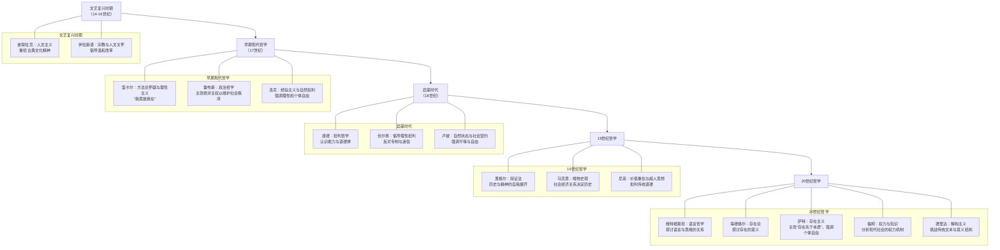

# 文艺复兴后西方哲学发展史

```mermaid
flowchart TD
    A[文艺复兴时期<br>（14-16世纪）]
    B[早期现代哲学<br>（17世纪）]
    C[启蒙时代<br>（18世纪）]
    D[19世纪哲学]
    E[20世纪哲学]

    A --> B
    B --> C
    C --> D
    D --> E

    subgraph S1 [文艺复兴时期]
      A1[彼得拉克：人文主义<br>重拾古典文化精神]
      A2[伊拉斯谟：宗教与人文关怀<br>倡导温和改革]
    end

    subgraph S2 [早期现代哲学]
      B1[笛卡尔：方法论怀疑与理性主义<br>“我思故我在”]
      B2[霍布斯：政治哲学<br>主张绝对主权以维护社会秩序]
      B3[洛克：经验主义与自然权利<br>强调理性和个体自由]
    end

    subgraph S3 [启蒙时代]
      C1[康德：批判哲学<br>认识能力与道德律]
      C2[伏尔泰：倡导理性批判<br>反对专制与迷信]
      C3[卢梭：自然状态与社会契约<br>强调平等与自由]
    end

    subgraph S4 [19世纪哲学]
      D1[黑格尔：辩证法<br>历史与精神的自我展开]
      D2[马克思：唯物史观<br>社会经济关系决定历史]
      D3[尼采：价值重估与超人思想<br>批判传统道德]
    end

    subgraph S5 [20世纪哲学]
      E1[维特根斯坦：语言哲学<br>探讨语言与思维的关系]
      E2[海德格尔：存在论<br>探讨存在的意义]
      E3[萨特：存在主义<br>主张“存在先于本质”，强调个体自由]
      E4[福柯：权力与知识<br>分析现代社会的权力机制]
      E5[德里达：解构主义<br>挑战传统文本与意义结构]
    end

    A --- A1
    A --- A2
    B --- B1
    B --- B2
    B --- B3
    C --- C1
    C --- C2
    C --- C3
    D --- D1
    D --- D2
    D --- D3
    E --- E1
    E --- E2
    E --- E3
    E --- E4
    E --- E5
```
